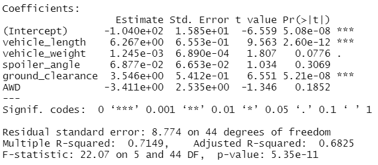
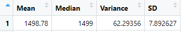
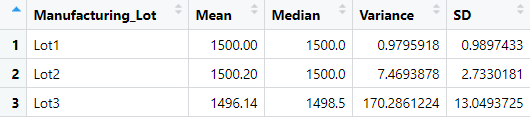
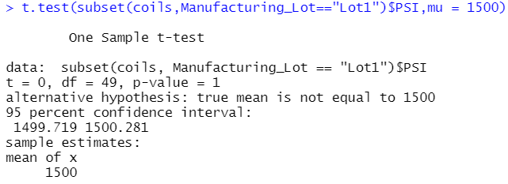
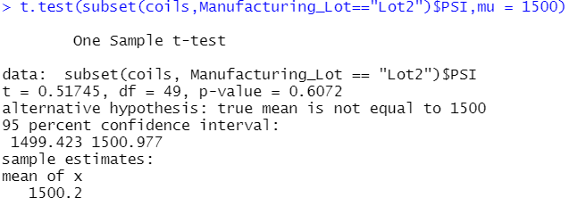
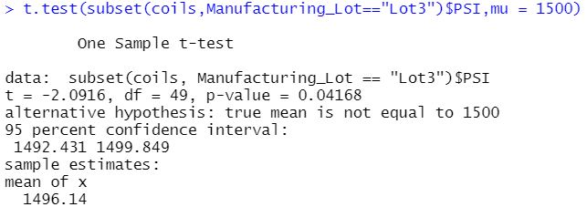
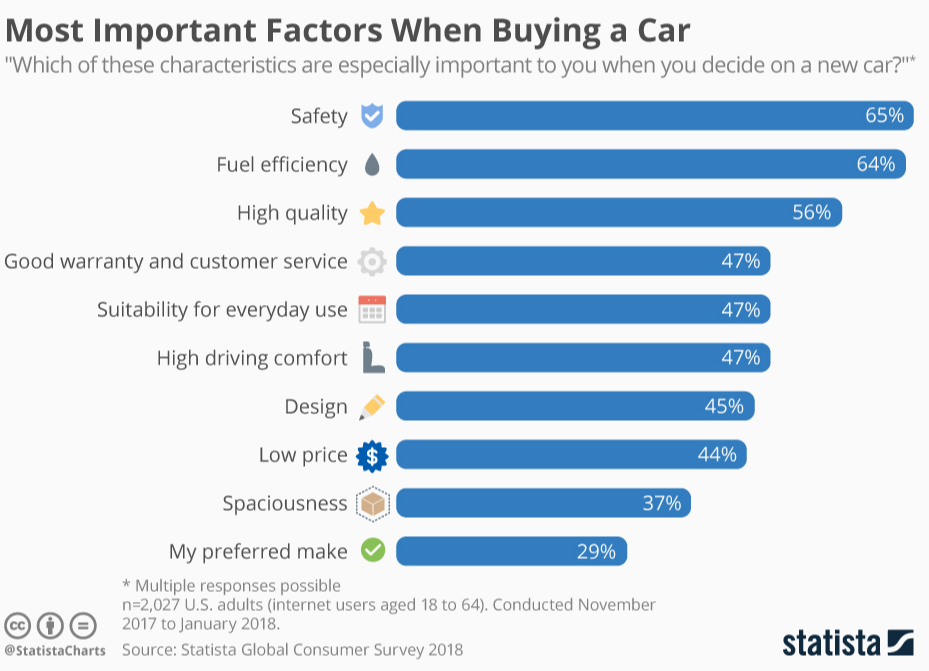

# MechaCar_Statistical_Analysis

## Linear Regression to Predict MPG
 

From our linear regression model, the r-swaured value is 0.71, which means that roughly 71% of the variability of our dependent variable (MPG) is explained using this linear model. The higher the correlation is between two variables, the more one variable can predict the value of the other.

As for the p-value of our linear regression analysis, 5.35 x10^-11 is much smaller than our assumed significance level of 0.05%, therefore we can state that there is sufficient evidence to reject our null hypothesis, which means that the slope of our linear model is not zero.

In addition to the statistical test, we can determine which variables provide a significant contribution to the linear model by comparing the individual p-values represented by the numbers in the PR(>|t|) column. According to the results, Vehicle Length. Ground Clearance and Y-intercept are statistically unlikely to provide random amounts of variance to the linear model. Therefore, you can say that the vehicles length and groud clearance have a significant impact on the MPG.

It is fair to say that a linear regression model is appropriate for this dataset and does provide the information on which variables were statistcally unlikely to provide random amounts of variance. However, the amount of information that can be obtained and analyzed will be far greater using a multiple linear regression model.

## Summary Statistics on Suspension Coils
 
 

The design specifications for the MechaCar suspension coils dictate that the variance of the suspension coils must not exceed 100 pounds per square inch. Lot 1 and Lot 2 are both within design specifications and have nearly the same mean and median. Lot 3 shows the most variance and exceeds the manufacturers specs. This is proven by analyzing the variance and standard deviation. In meeting design specifications, manufacturers require a minimal variance and standard deviation based on the min/max allowed by the designer. Lot 3 shows the largest variance along with its mean and median varying far from the required 1500.

## T-Tests on Suspension Coils
 
 
 

Assuming our significance level was the common 0.05 percent, in order to state that the two means are statistically similar, our p-value is must be above our significance level. Lot 1 and Lot 2 have a p-value of 1.0 and 0.61 respectively; therefore, we do not have sufficient evidence to reject the null hypothesis, and we would state that the two means are statistically similar. However lot 3 the p-value is 0.04 which means there is evidence that the suspension coil is different from the population mean and in this case, we would reject null hypothesis.

## Study Design: MechaCar vs Competition

According to Statistica Global Consumer Survy 2018, the top factor for choosing a new car is Safety. Using this chart, we can take the top quantitative factors and use them as our metrics to compare MechaCar vehicles against the performance of vehicles from other manufacturers. The most ideal and commonly available quatitative factors would be Safety Ratings, Fuel Efficiency (MPG), Warranty Period, MSRP of Vehicle, Spaciousness(seating), and Design (engine size and HP). There are several options in comparing MechaCar to its competitors:
- t-tests in direct comparisons of each catergory listed above.
- Using an Anova Test to compare MechaCar's MPG based on vehicle seatings (size) and price (where you get the most for your dollar).
- Comparisons of Safety with HP and how safety can be potentially reduced with more HP cars (is safety reduced at higher HP?).

Null Hypothesis (Ho): MechaCar is priced correctly based on its performance of key factors.
Alternative Hypothesis (Ha): MechaCar is NOT priced correctly based on performance of key factors.

### Statistical Tests
A multiple linear regression would be used to determine the factors that have the highest correlation/predictability with the list selling price (dependent variable)
